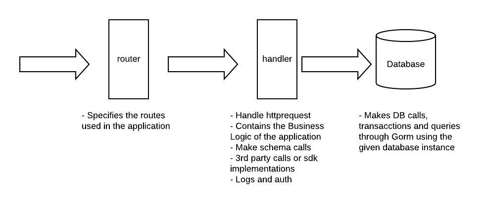
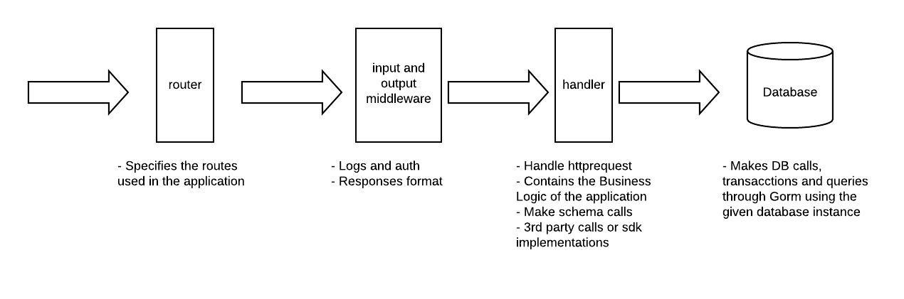
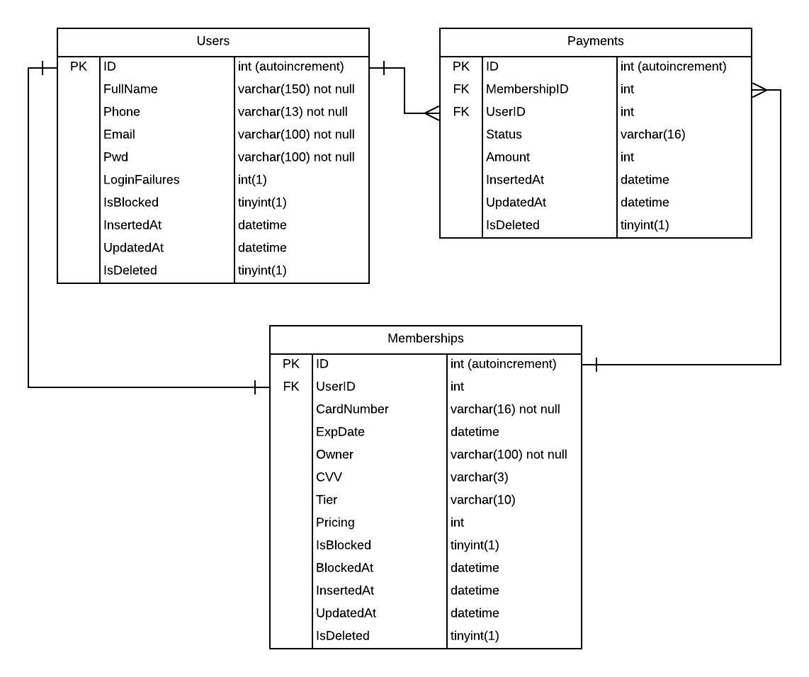
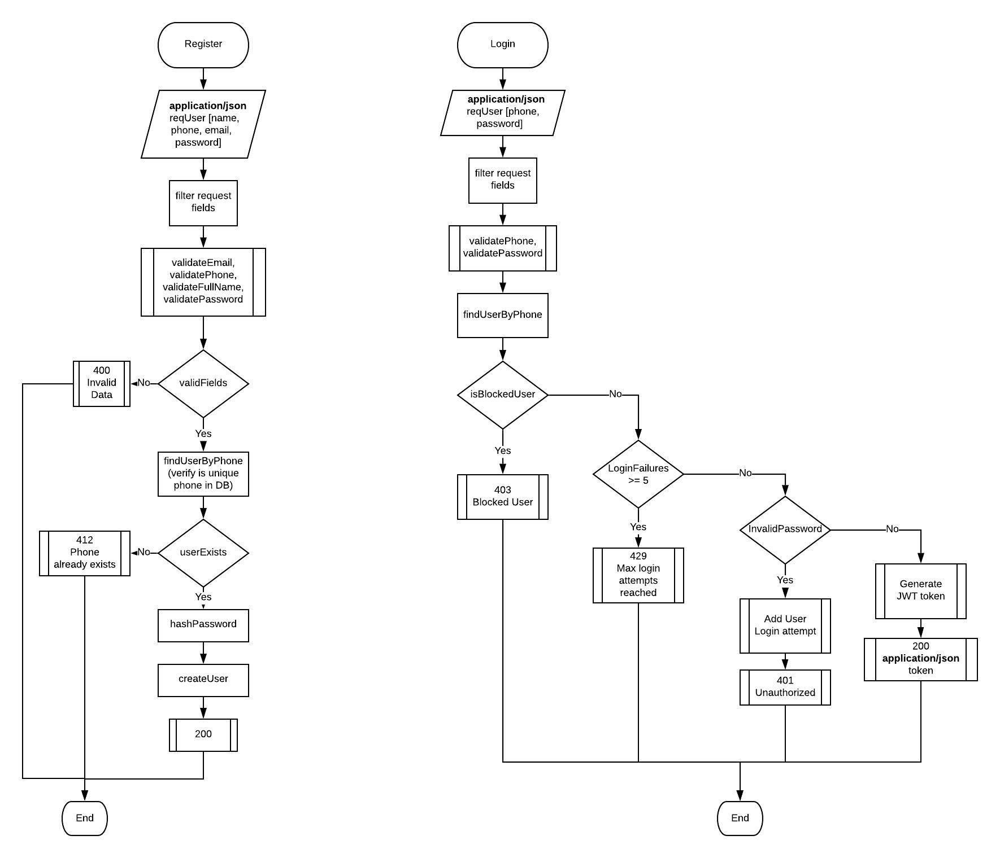
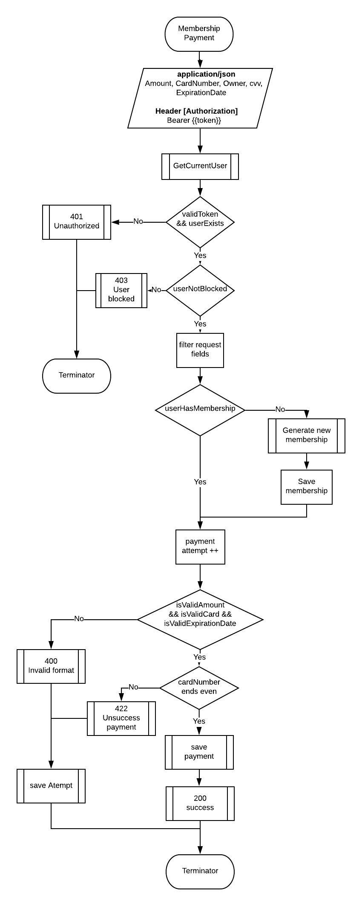
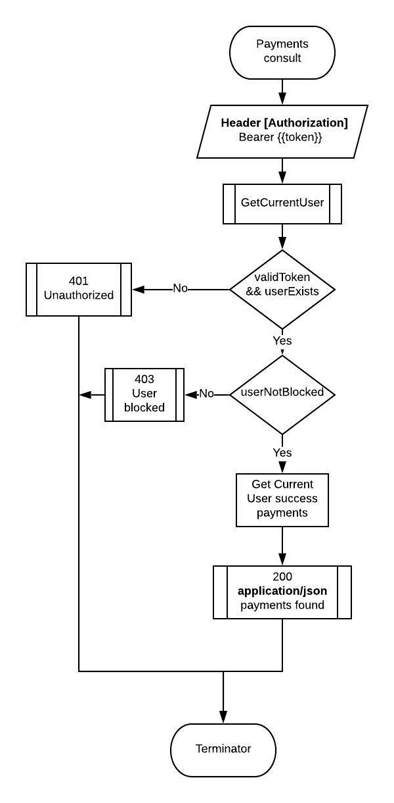

# Overview

## Test General description
It is required to build an API Rest to affiliate clients, allow them to make a payment of their
membership and allow them to see your payments made. In total there are 4 use cases, which
described below:

### Case 1. Registration
Description
The API must allow a client to register with the following basic data: Name
full, phone number, email and password. These data should be stored those
data in the database.
Validations
- [] The telephone number (cell phone only) must have a correct format for Mexico
(E.g. +525123456789).
- [x] The full name field must have more than one word, and each word must
have initial capital letters (E.g. Pedro Rodríguez Álvarez).
- [x] The password must have at least one lowercase letter, one uppercase letter and one
number and contain at least 8 characters.
Answers
The service must reply with:
- [x] 200 - if registration is successful
- [x] 400 - if there is an error with the input data
- [x] 412 - if the customer (same phone number) already exists

### Case 2. Login
Description
The API must allow a login with the phone number and password.
Validations
After 5 failed attempts, the user must be blocked.

Answers
The service must reply with:
- [x] 200 - if the login is successful
- [x] 400 - if the data sent is not in the valid format
- [x] 401 - if the login information is incorrect
- [x] 403 - if the user was blocked
- [x] 429 - if the maximum number of login attempts exceeded

### Case 3. Membership payment
Description
The API must allow you to make a payment from your own membership, where the amount to
pay and fictitious credit card information (card number, expiration date,
name of the owner and CVV).
Validations
- [x] A client can only pay for her own membership.
- [x] The amount must not exceed 100,000 Mexican pesos.
- [x] Each payment attempt must be stored.
- [x] If the card number ends in an even digit, you must successfully answer the
transaction. Conversely, if it ends in an odd number, you must answer rejected.
- [x] After 3 unsuccessful payment attempts, the user must be blocked to login and to
pay membership.
- [x] The card number must be a field consisting of 16 digits. The first field does not
it can be a zero.
- [x] The expiration date must be a field consisting of 4 digits, in format
MMYY.
- [x] The CVV must be a 3 digit field.
Answers
The service must reply with:
- [x] 200 - if payment is successful
- [x] 400 - if the data sent does not have the valid format or the amount is greater than 100
thousand Mexican pesos
- [x] 401 - if you have not logged in
- [x] 403 - if the user tries to pay a membership of another client or the user is
locked
- [x] 422 - if the payment was not successful
- [x] 429 - if the client exceeded the maximum number of attempts allowed to pay the
membership

### Case 4. Consultation of membership payments
Description
Finally, the API must allow consulting the history of successful payments of the membership of the
user who consults.
Validations
- [x] You should not allow showing payments from another user. (Implicit because the architecture of the API whic uses jwt and for this enpoint you dont set other clientID)
Answers
The service must reply with:
- [x] 200 - if the consultation is successful
- [x] 401 - if you have not logged in
- [x] 403 - if the user tries to obtain the list of membership payments from another client
Note: The language to use must be Golang. The database can be Postgres or MySQL.

## Achievement
**The test is completed at 96%** due to time issues explained in the email.

# Architecture

## Tools and framework
1. Language: Golang (_Required_)
2. Http framework: [Httprouter](https://github.com/julienschmidt/httprouter)
    * Fast
    * Simple
    * Light
    * Good integrations with watchdogs and logging
3. Project structure: [Go modules](https://blog.golang.org/using-go-modules)
    * Mostrly used for microservices
    * Low coupled code
    * Multifunctional (Monorepo but can handle independient applications)
4. Database: [Mysql](https://dev.mysql.com/doc/mysql-installation-excerpt/5.7/en/)
    * Simple
    * Easy to install
5. Container: [docker-compose](https://docs.docker.com/compose/install/)
    * OS independient 
    * Good testing integration
    * Good DevOps integrations
6. ORM: [Gorm](https://gorm.io/docs/index.html)
    * Easy to develop
    * Reduce develop timing and increase productivity
    * Easy to integrate with DB
7. Environment variables handler: [Envconfig](github.com/kelseyhightower/envconfig)
    * You have the env variables in one place and ready in the application memory for use
    * It allows you to have all needed env variables and indicate the required so you can't miss any of them 
8. Authentication handler: [jwt-go](github.com/dgrijalva/jwt-go/v4)
    * Good integration
    * Easy to use
    * Standarized with auth0, OAuth2, SSO,  etc for robust security in larger applications or microservices
    * The application is an API so is best to have security tokens as standard 
9. Logging and trace: [logrus](github.com/sirupsen/logrus)
    * Easy implementation
    * Improve log reading
    * Versatile and prepared for several formats (json, spaces) which can be integrated with other log services or query services thanks to the format
10. Testing: [testify](github.com/stretchr/testify)
    * Integrated with go

The architecture used for this project is for Go modules for microservices due to the easy implementation of DevOps, maintainance and flexibility for adding new features and implementation.

The ptoject uses the following folder structure:

* assets (readme assets and swagger)
    * swagger (swagger yaml)
* build (docker and k8 [not implemented])
* cmd (neccesary functions to start the applications but not the Business logic)
    * api (single tools for running an application, could be more than 1 application)
        * handlers (routes and handler)
* configs (.env)
* deployments (docker-compose.yml)
* internal (decoupled core modules for the app)
    * config
    * platform
        * auth  (jwt)
        * database  (databse functions decoupled from DB)
            * schema    (mysql schemas)
        * web (http codes, functions and tools for the application web handling)
    * responses (http responses structure)
    * utils
* scripts (needed for initialize the application )
    * db
* tests

## Diagrams

The layers used for the application are:
* Main
* Router
* Handler
* Database

####Improovements
* Middleware JWT
* Middleware out for response handling and logging instead of having logs in handler

### ER database diagram

**Description**
The previous image describes the ER diagram for the Database with the following reasons for this particular choice
1. The application only needs 3 main entities for operations (Payments) and catalog (Users, Memberships)
2. The scope of the project does not require major operations such as login historial, password historial or multiple user memberships
3. The Users entity contains the login failures count because there's no need to implement a login historial table, at least not for this case
4. Memberships entity contains ExpDate, CVV fields which are not required fields due to security reasons and are disabled inside the code.
 Tier, Pricing and IsBloccked fields are not part of the scope but are needed because of common sense, the first indicates whether is normal or not, the second is the amount to pay when that feature is developed at last the IsBlocked field indicates if the membership is blocked for external reasons (not implemented)
 5. Payments entity is a many to many relationship which stoores all user payments attemprs whether are successfull or not and it only stores the UserID, MembershipID, Amount and the status (success or unsuccess).
 6. Status entity is not implemented due to time reasons but is neccesary as a Catalog for Users, Memberships and Payments

 **Improvements**
 1. Status table
 2. Login historial
 3. Memberships_Users table is the user needs to attach one more Card to his account
 4. Password historial

### Flow

**General**
The Register, Login, Membership endpoints receive a JSON with the required fields then validates the request body and parses it into a new structure that is because we don't want the requests to set more values than the required and is a way to discard those extra fields from the incommin request.

Logs are used for every error or validation failure

Jwt validation  is available for Membership registration and Payments consult, its inside the handler and not as middleware because of the develop time, and there are Business Rules (validate user blocked ) that may conflict with the new flow.

**Register**

The "IsValidEmail" and "IsValidPhone" validations functions are not in User Schema because these are not User exclusive but utility, on the otrher hand "IsValidFullName" and "IsValidPassword" are part of an User.
As the api is using go modules for microservices the extra layers are not used so it was required a trade-off between business logic and DB calls 

**Login**
The validations are separated due to each of them returns different http responses.
The JWT generation is implemeted due to security reasons and as API call standard, is valid for 24hrs and it uses all claims for a  further integration with SSO or auth0 with API gateway like Konga where the communication between microservices in subdomains are present.

**Membership Payment**
The jwt authentication is available for this endpoint.
In this case there is an extra call for membership which can be done when retreiveing the user from JWT, this can be done in future update.
Here we validate membership and user status along with the request data and the rule of odd and even for the last cardNumber.

**Payments Consult**
The jwt authentication is available for this endpoint.
As the endpoint doesn't allow external IDs as url params then there's no way to call for other clients payments but the ones for the User obtained from the token.
It returns success payments whether exists or not.

# RUN APLLICATION
## Requisites

* [Docker installed](https://docs.docker.com/get-docker/)
* [Docker-Compose installed](https://docs.docker.com/compose/install/)
* [Go installed](https://golang.org/doc/install)

## Export Env variables
* cd current_root_project_path
* export $(xargs <configs/example.env)

## Database

### Docker Compose
* cd current_root_project_path/deployments
* docker-compose up -d

## Run application
* cd current_root_project_path
* go mod download
* go run cmd/api/main.go